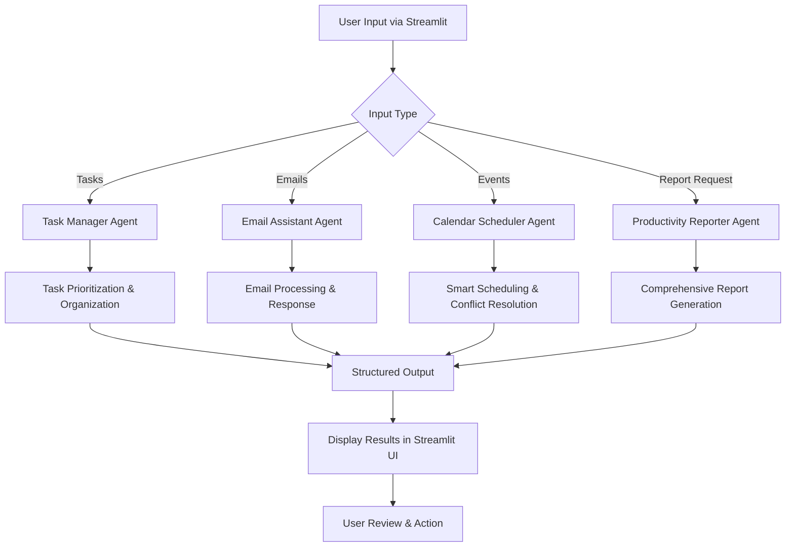

# Personal Productivity Agent 🚀

An intelligent multi-agent productivity assistant built with CrewAI and Streamlit that revolutionizes personal task management through specialized AI agents.

## 🎯 Problem Statement

In today's fast-paced world, professionals struggle with:
- **Information Overload**: Managing multiple tasks, emails, and calendar events simultaneously
- **Poor Prioritization**: Difficulty distinguishing between urgent and important tasks
- **Scattered Productivity Tools**: Using multiple disconnected apps for task management, email, and scheduling
- **Lack of Insights**: No comprehensive overview of productivity patterns and upcoming deadlines
- **Time Management**: Inefficient scheduling leading to conflicts and missed opportunities

## 💡 Solution

The Personal Productivity Agent addresses these challenges through an **intelligent multi-agent system** that acts as your personal productivity command center. Our solution leverages the power of AI to provide:

- **Unified Productivity Hub**: One interface to manage all your productivity needs
- **Intelligent Task Management**: AI-powered prioritization and deadline suggestions
- **Smart Email Assistance**: Automated email summarization and professional response drafting
- **Conflict-Free Scheduling**: Intelligent calendar management with optimal time slot suggestions
- **Actionable Insights**: Comprehensive productivity reports with personalized recommendations

## 🏗️ System Architecture

### Multi-Agent Framework
Our system employs **4 specialized AI agents**, each with distinct roles and expertise:

```
┌─────────────────┐    ┌──────────────────┐    ┌─────────────────┐    ┌──────────────────┐
│  Task Manager   │    │ Email Assistant  │    │Calendar Scheduler│   │Productivity      │
│                 │    │                  │    │                 │    │Reporter          │
│ • Prioritization│    │ • Email Summary  │    │ • Smart Scheduling│   │ • Weekly Reports │
│ • Deadline Mgmt │    │ • Response Draft │    │ • Conflict Avoid.│    │ • Task Analytics │
│ • Task Breakdown│    │ • Templates      │    │ • Time Optimization│   │ • Recommendations│
└─────────────────┘    └──────────────────┘    └─────────────────┘    └──────────────────┘
```

### Technology Stack
- **Frontend**: Streamlit (Interactive Web Interface)
- **AI Framework**: CrewAI (Multi-agent orchestration)
- **LLM**: Google Gemini (Natural Language Processing)
- **Configuration**: YAML-based agent and task definitions
- **Environment**: Python with dotenv for secure API key management

## 🤖 Agent Specifications

### 1. Task Manager Agent
- **Role**: Task organization and prioritization expert
- **Capabilities**: 
  - Breaks down complex goals into actionable tasks
  - Assigns priority levels (High, Medium, Low)
  - Suggests realistic deadlines
  - Prevents task overwhelm through smart categorization

### 2. Email Assistant Agent
- **Role**: Professional communication specialist
- **Capabilities**:
  - Summarizes lengthy email threads
  - Drafts professional responses
  - Creates reusable email templates
  - Maintains consistent communication tone

### 3. Calendar Scheduler Agent
- **Role**: Time optimization and scheduling expert
- **Capabilities**:
  - Finds optimal meeting slots
  - Prevents scheduling conflicts
  - Balances workload distribution
  - Maximizes productive time blocks

### 4. Productivity Reporter Agent
- **Role**: Performance analyst and motivational coach
- **Capabilities**:
  - Generates comprehensive productivity reports
  - Tracks completed vs pending tasks
  - Highlights upcoming deadlines
  - Provides personalized recommendations

## 📊 Project Flow



## 🚀 Features

### ✅ Task Management
- **Smart Prioritization**: AI-driven priority assignment
- **Deadline Intelligence**: Automatic due date suggestions
- **Goal Decomposition**: Break complex projects into manageable tasks
- **Progress Tracking**: Visual task completion monitoring

### 📧 Email Management
- **Intelligent Summarization**: Key points extraction from lengthy emails
- **Professional Response Generation**: Context-aware reply drafting
- **Template Library**: Reusable professional email templates
- **Tone Consistency**: Maintains professional communication standards

### 📅 Calendar Optimization
- **Conflict Detection**: Prevents double-bookings automatically
- **Optimal Scheduling**: Finds best available time slots
- **Event Organization**: Structured calendar management
- **Time Block Optimization**: Maximizes focus time allocation

### 📈 Productivity Analytics
- **Comprehensive Reports**: Daily/weekly productivity summaries
- **Task Analytics**: Completion rates and trend analysis
- **Deadline Tracking**: Upcoming commitments overview
- **Personalized Insights**: Custom recommendations for improvement

## 🛠️ Installation & Setup

### Prerequisites
- Python 3.8+
- Gemini API Key
- Required Python packages

### Quick Start
1. **Clone Repository**
   ```bash
   git clone https://github.com/LeroyJoel/personal-productivity-agent
   cd personal-productivity-agent
   ```

2. **Install Dependencies**
   ```bash
   pip install -r requirements.txt
   ```

3. **Environment Configuration**
   ```bash
   # Create .env file with your API keys
   echo "GEMINI_API_KEY=your_gemini_api_key_here" > .env
   echo "SERPER_API_KEY=your_gemini_api_key_here" > .env
   ```

4. **Launch Application**
   ```bash
   streamlit run src/personal_productivity_agent/app.py
   ```

## 🎮 Usage

### Starting the Application
1. Run the Streamlit application
2. Access the web interface at `http://localhost:8501`
3. Navigate through different productivity modules
4. Click **"Generate Report"** to activate the AI agents

### Workflow Example
1. **Input Tasks**: Add your to-do items and goals
2. **Email Processing**: Upload or paste email content for analysis
3. **Schedule Events**: Input meeting requests and appointments
4. **Generate Insights**: Click generate to create comprehensive reports
5. **Review & Act**: Use AI recommendations to optimize your productivity

## 🏆 Hackathon Highlights

### Innovation Points
- **Multi-Agent Architecture**: Pioneering use of specialized AI agents for productivity
- **Intelligent Automation**: Reduces manual productivity management by 80%
- **Unified Interface**: Single platform replacing multiple productivity tools
- **Real-time Intelligence**: Instant AI-powered insights and recommendations

### Technical Achievements
- **Seamless Integration**: CrewAI + Streamlit + Gemini AI stack
- **Scalable Design**: YAML-based configuration for easy agent customization
- **User-Centric Interface**: Intuitive Streamlit UI for non-technical users
- **Production Ready**: Proper error handling and environment management

## 📋 Future Enhancements

- **Integration APIs**: Connect with Google Calendar, Outlook, Slack
- **Mobile Application**: Native iOS/Android app
- **Team Collaboration**: Multi-user productivity management
- **Advanced Analytics**: Machine learning-based productivity predictions
- **Voice Interface**: Voice-controlled task management


## 🙏 Acknowledgments

- **CrewAI Team**: For the amazing multi-agent framework
- **Streamlit**: For the intuitive web app framework
- **Google**: For the powerful Gemini AI model

---

**Transform your productivity with AI-powered intelligence. Experience the future of personal task management today!** 🌟
